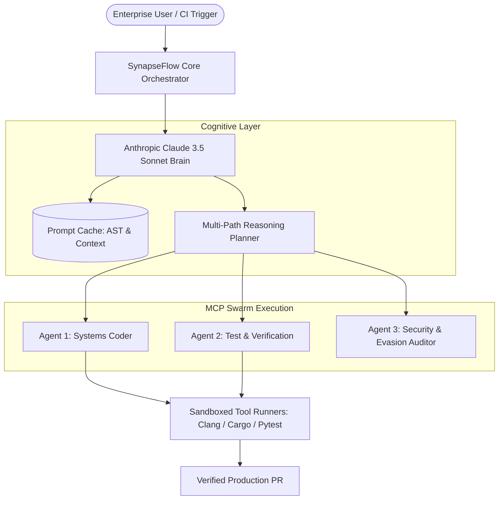

# KazeLab AI — SynapseFlow Platform

> **Next-Generation Autonomous Multi-Agent Cognitive Architecture & Enterprise Intelligence**

[-blue?style=flat-square)](https://modelcontextprotocol.io)

---

## 🌟 Overview

**KazeLab AI** is an autonomous agent orchestration and cognitive architecture platform engineered for mission-critical software systems. By pairing Anthropic's **Claude 3.5 Sonnet** foundation models with the **Model Context Protocol (MCP)**, SynapseFlow enables deterministic, self-healing code synthesis and enterprise-scale repository refactoring.

### Key Capabilities
* **Prompt Caching & AST Dependency Graphs**: In-memory codebase representations reducing token overhead and latency by up to 85%.
* **Deterministic Tool Calling via MCP**: Native integration with compiler toolchains (`cargo`, `clang`, `pytest`), debuggers, and sandboxed test environments.
* **Autonomous Goal Pursuit**: Multi-agent swarms operating in self-directed loops: *Analyze $\rightarrow$ Plan $\rightarrow$ Execute $\rightarrow$ Compile $\rightarrow$ Self-Heal*.
* **Formal Verification**: Verification loops designed for zero-defect production deployment.

---

## 🏗️ Architecture

---

## 🌐 Live Infrastructure
* **Official Website**: [https://kazelab.xyz](https://kazelab.xyz)
* **Contact & Enterprise Inquiries**: `founder@kazelab.xyz`

---

## 📄 License
This repository is licensed under the Apache 2.0 License. © 2024-2026 KazeLab AI.
