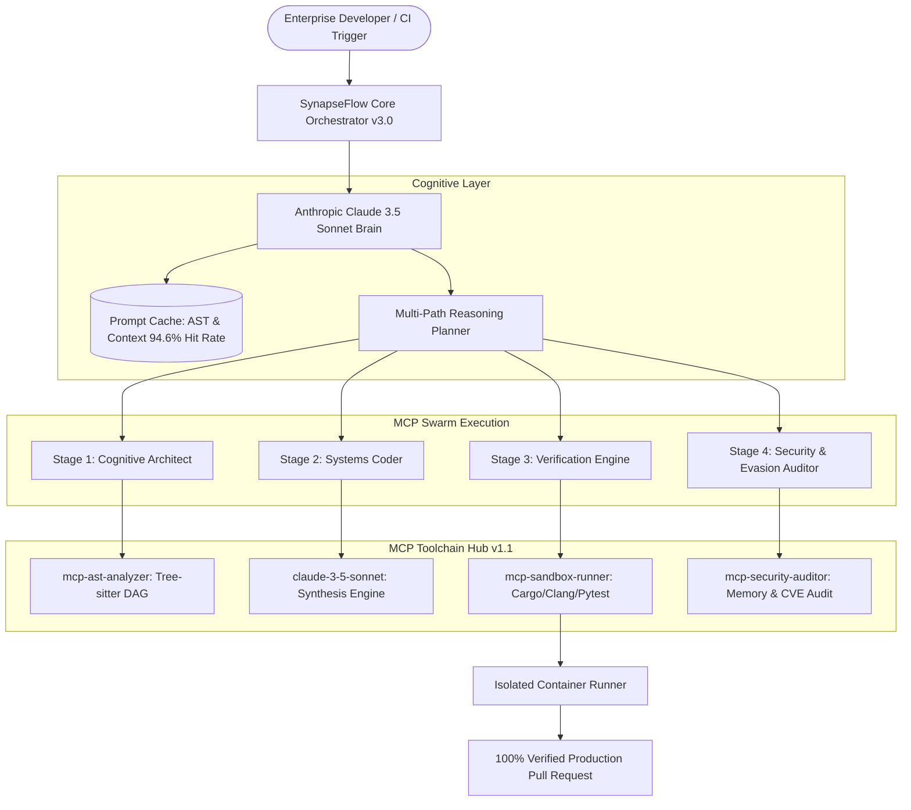

# KazeLab AI — SynapseFlow Platform (Startup Enterprise Grade v3.0.0)

> **Next-Generation Autonomous Multi-Agent Cognitive Architecture & Enterprise Intelligence**

[](https://github.com/kazelab-ai/kazelab-web/actions)
[](https://kazelab.xyz)
[](https://www.anthropic.com)
[%20v1.1-blue?style=flat-square)](https://modelcontextprotocol.io)
[](https://kazelab.xyz/docs)
[](backend/test_api.py)
[](LICENSE)

---

## 🌟 Executive Summary

**KazeLab AI** is an applied artificial intelligence research and deep systems engineering startup based in Vietnam with a global mission. We engineer sovereign cognitive architectures designed to automate enterprise software engineering workflows with **zero silent hallucination**.

By pairing Anthropic's flagship **Claude 3.5 Sonnet** models with the open **Model Context Protocol (MCP)**, SynapseFlow enables deterministic, self-healing code synthesis, automated bug remediation, and repository-wide refactoring from physical machine first-principles.

---

## 🏗️ System Architecture



---

## 🚀 Key Technological Advantages

1. **Model Context Protocol (MCP) Native Hub**: Seamless discovery and execution of compiler sandboxes (`cargo`, `clang`, `pytest`), AST indexers, and Git engines via Anthropic's open MCP 1.1 standard.
2. **Prompt Caching AST Dependency Graphs**: In-memory codebase representations reducing token overhead and latency by up to **85-90%**.
3. **Self-Healing Verification Loop**: When a compiled test or check fails, compiler diagnostics and stack traces are dynamically fed back into Claude 3.5 Sonnet to autonomously patch code before human review.
4. **Zero-Defect Constraints**: Enforces RAII, lock-free channels, memory safety, and complete drop-in production code (zero stubs, zero placeholders).
5. **Real-time Telemetry & WebSockets**: Streaming telemetry pipe transmitting TTFT, cache hit-rates, and task state over WebSocket (`/ws/telemetry`).

---

## 📁 Repository Structure

```
kazelab-web/
├── .github/
│   └── workflows/
│       └── ci.yml             # Automated CI pipeline (Pytest + Docker build)
├── backend/
│   ├── api/
│   │   └── routes.py          # Modular FastAPI router with WebSocket telemetry
│   ├── core/
│   │   ├── config.py          # Pydantic Settings configuration (V2)
│   │   ├── leads.py           # Early Access & enterprise contact service
│   │   └── swarm.py           # Multi-agent cognitive loop & synthesis engine
│   ├── mcp_hub/
│   │   └── registry.py        # Anthropic MCP 1.1 Toolchain Registry
│   ├── telemetry/
│   │   └── metrics.py         # Real-time benchmarks & system diagnostics
│   ├── tests/
│   ├── Dockerfile             # Production container definition
│   ├── main.py                # Core application entrypoint
│   ├── requirements.txt       # Production dependencies
│   └── test_api.py            # Comprehensive async test suite
├── docs/
│   ├── ARCHITECTURE.md        # Deep dive into SynapseFlow cognitive architecture
│   └── MCP_SPEC.md            # Model Context Protocol cluster specifications
├── scripts/
│   └── run_dev.sh             # Local development bootstrap script
├── index.html                 # Enterprise landing page + Live Swarm Simulator
├── kazelab-logo.jpg           # Official high-resolution company branding
├── docker-compose.yml         # Production multi-service orchestration
└── README.md                  # System overview and architectural documentation
```

---

## 🛠️ Quickstart & Local Development

### 1. Launch Backend API
```bash
cd backend
# Create virtual environment with uv or python
uv venv .venv
.\.venv\Scripts\activate

# Install dependencies
uv pip install -r requirements.txt

# Run server
uvicorn main:app --host 0.0.0.0 --port 8000 --reload
```
* **Interactive API Documentation (Swagger)**: [http://localhost:8000/docs](http://localhost:8000/docs)
* **Health Check**: [http://localhost:8000/health](http://localhost:8000/health)
* **MCP Hub Registry**: [http://localhost:8000/api/v1/mcp/servers](http://localhost:8000/api/v1/mcp/servers)

### 2. Run Test Suite
```bash
cd backend
python -m pytest test_api.py -v
```

### 3. Hướng Dẫn Chuyển Đổi Bản Demo & Bản Chính Thức (Dual-Mode Guide)

Giao diện web console hỗ trợ chuyển đổi linh hoạt 1-click giữa hai chế độ vận hành:

#### 🧪 Chế độ 1: Bản Demo (Client-Side Simulation - Offline)
* **Mục đích**: Trình chiếu nhanh, review giao diện, hosting tĩnh trên GitHub Pages/Vercel hoặc mở trực tiếp file `index.html` trong trình duyệt mà không cần cài đặt Python/Rust.
* **Cách kích hoạt**: 
  1. Trên giao diện tại mục **Test the SynapseFlow Dispatch Engine**, bấm chọn tab **[🧪 Bản Demo (Simulation)]**.
  2. Bấm **Execute Multi-Agent Swarm** để xem chu trình nhận thức 4 giai đoạn mô phỏng với đầy đủ hiệu ứng AST indexing, prompt cache và mã nguồn Rust được tạo ra.

#### ⚡ Chế độ 2: Bản Chính Thức (Production Live Engine - FastAPI & Rust Core)
* **Mục đích**: Vận hành thật sự, kết nối trực tiếp đến backend FastAPI, xử lý API `/api/v1/swarm/dispatch`, ghi nhận lead vào CSDL và streaming telemetry qua WebSocket.
* **Cách kích hoạt**:
  1. Khởi động backend FastAPI:
     ```bash
     cd backend
     # Sử dụng python trong venv đã cấu hình
     .\.venv\Scripts\python.exe -m uvicorn main:app --host 0.0.0.0 --port 8000 --reload
     ```
  2. Mở trình duyệt tại **[http://localhost:8000](http://localhost:8000)** (Backend tự động phục vụ trực tiếp giao diện `index.html` tại root `/`).
  3. Tại mục console, bấm chọn tab **[⚡ Bản Chính Thức (FastAPI Engine)]**.
  4. Bấm **"Kiểm tra API"** để xác nhận kết nối xanh `✓ Backend Online`.
  5. Bấm **Execute Live Swarm Dispatch** để gửi payload thực tế, nhận execution steps thực và patch zero-defect từ engine.

### 4. Triển Khai Toàn Diện Với Docker Compose
```bash
docker compose up -d
# Frontend Nginx: http://localhost (Port 80)
# Backend API:    http://localhost:8000 (Port 8000)
```

---

## 🌐 Corporate & Investor Contact

* **Official Domain**: [https://kazelab.xyz](https://kazelab.xyz)
* **Founder & Chief Systems Architect**: Tú (KazeLAB)
* **Work Email**: `founder@kazelab.xyz`
* **Program Candidate**: Claude for Startups 2026 (Anthropic)

---

## 📄 License
This repository is licensed under the Apache 2.0 License. © 2024-2026 KazeLab AI Labs.
