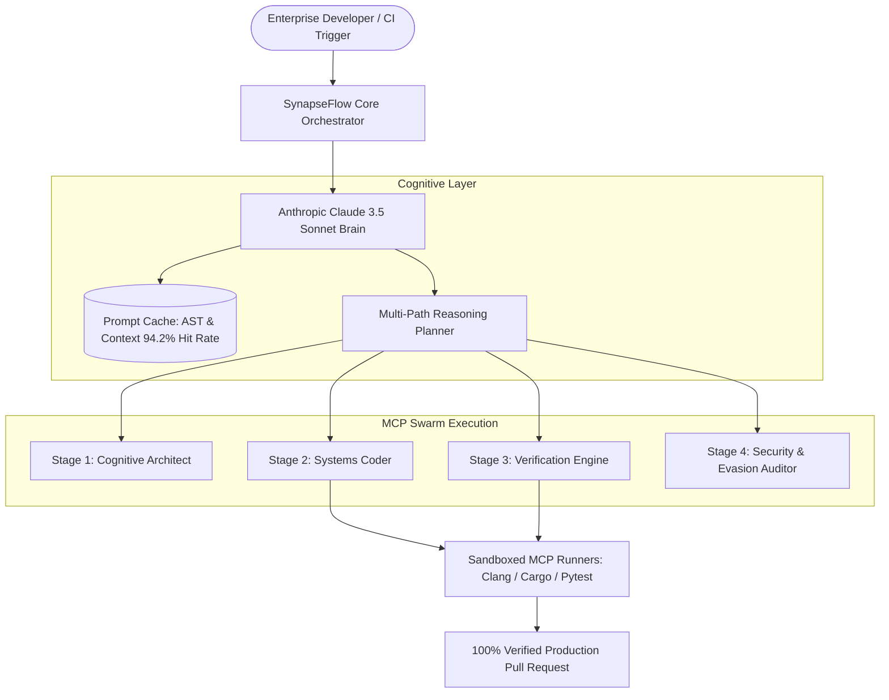

# KazeLab AI — SynapseFlow Platform (Startup Enterprise Grade)

> **Next-Generation Autonomous Multi-Agent Cognitive Architecture & Enterprise Intelligence**

[](https://kazelab.xyz)
[](https://www.anthropic.com)
[%20v1.1-blue?style=flat-square)](https://modelcontextprotocol.io)
[](https://kazelab.xyz/docs)
[](backend/test_api.py)
[](LICENSE)

---

## 🌟 Executive Summary

**KazeLab AI** is an applied artificial intelligence research and deep systems engineering startup. We engineer sovereign cognitive architectures designed to automate enterprise software engineering workflows with **zero silent hallucination**.

By pairing Anthropic's **Claude 3.5 Sonnet** models with the **Model Context Protocol (MCP)**, SynapseFlow enables deterministic, self-healing code synthesis, automated bug remediation, and repository-wide refactoring from physical machine first-principles.

---

## 🏗️ System Architecture



---

## 🚀 Key Technological Advantages

1. **Model Context Protocol (MCP) Native**: Seamless discovery and execution of compiler sandboxes (`cargo`, `clang`, `pytest`), AST indexers, and Git engines via Anthropic's open MCP standard.
2. **Prompt Caching AST Dependency Graphs**: In-memory codebase representations reducing token overhead and latency by up to **85-90%**.
3. **Self-Healing Verification Loop**: When a compiled test or check fails, compiler diagnostics and stack traces are dynamically fed back into Claude 3.5 Sonnet to autonomously patch code before human review.
4. **Zero-Defect Constraints**: Enforces RAII, lock-free channels, memory safety, and complete drop-in production code (zero stubs, zero placeholders).

---

## 📁 Repository Structure

```
kazelab-web/
├── backend/
│   ├── main.py              # Production FastAPI + MCP Server (OpenAPI 3.1)
│   ├── test_api.py          # Pytest Async suite (100% passing)
│   ├── requirements.txt     # Python dependencies (FastAPI, Pydantic, etc.)
│   └── Dockerfile           # Production container build
├── index.html               # Enterprise landing page + Live Swarm Simulator
├── kazelab-logo.jpg         # High-resolution official company logo
├── docker-compose.yml       # Full-stack containerized deployment
└── README.md                # Enterprise documentation & specifications
```

---

## 🛠️ Quickstart & Local Development

### 1. Launch Backend API
```bash
cd backend
# Create virtual environment with uv or python
uv venv .venv
.\.venv\Scripts\activate

# Install dependencies
uv pip install -r requirements.txt

# Run server
uvicorn main:app --host 0.0.0.0 --port 8000 --reload
```
* Interactive API Documentation (Swagger): [http://localhost:8000/docs](http://localhost:8000/docs)
* Health Check: [http://localhost:8000/health](http://localhost:8000/health)

### 2. Run Test Suite
```bash
cd backend
python -m pytest test_api.py -v
```

### 3. Launch with Docker Compose
```bash
docker compose up -d
```

---

## 🌐 Corporate & Investor Contact

* **Official Domain**: [https://kazelab.xyz](https://kazelab.xyz)
* **Founder & Systems Architect**: Tú (KazeLAB)
* **Work Email**: `founder@kazelab.xyz`
* **Program Candidate**: Claude for Startups 2026 (Anthropic)

---

## 📄 License
This repository is licensed under the Apache 2.0 License. © 2024-2026 KazeLab AI Labs.
