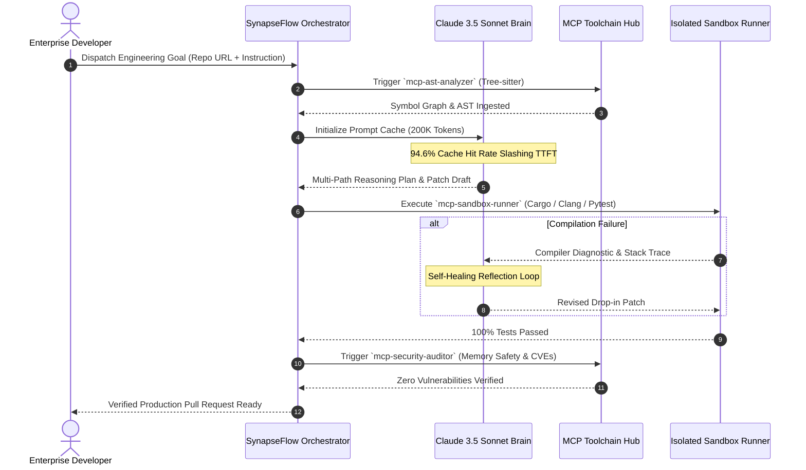

# KazeLab SynapseFlow — Cognitive Architecture Specification

## Abstract
SynapseFlow replaces linear, ungrounded LLM prompting with a closed-loop, multi-agent cognitive architecture. Powered by **Anthropic Claude 3.5 Sonnet** and the **Model Context Protocol (MCP)**, the system guarantees that code generated by AI is compiled, verified in sandboxes, and checked for zero-defect physical machine invariants before human pull request creation.

---

## 1. Multi-Stage Swarm Execution Loop

---

## 2. Invariant Guarantees
- **Memory Safety**: Absolute adherence to RAII, Rust borrow-checker rules, and zero uninitialized buffers.
- **Concurrency**: Lock-free single-producer single-consumer queues and asynchronous non-blocking I/O.
- **Zero-Stub Policy**: No code placeholders (`// TODO`, `pass`, `/* rest of code */`). Every patch is complete, drop-in production code.
